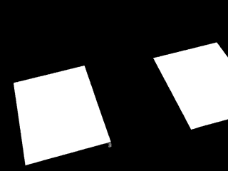

**Kleine Quader**
1. Ein Projekt, bei dem verschiedene Menschen gemeinsam kleine Büchlein produzieren. 
2. Eine Anzahl von 16 Beiträgen unterschiedlicher Herkunft und Thematik.
3. Ein Format auf Papier und Grösse A6 gefaltet. 

**Ablauf**

Wenn du bei Kleine Quader mitmachst, hältst du am Schluss 16 kleine Büchlein in der Hand. Jedes davon wurde von einer anderen Person gestaltet und umgesetzt. 

Dazu kommt es in drei Schritten: (1) Du gestaltest ein Büchlein, ganz frei, nach einem Thema deiner Wahl oder ohne Thema. (2) Du stellst davon 20 Stück her. Sie müssen genau dem Format DIN A6 entsprechen (105x148mm) und dürfen nicht dicker als 3mm sein. (3) An der Vernissage gibst du allen andern Autorinnen und Autoren (plus dem Organisatorenteam und dem Archiv) eines deiner Büchlein. Gleichzeitig bekommst auch du von allen ein Büchlein. Am Schluss hast du eine limitierte Edition von 16 Büchlein in der Hand. 

**Information**

Falls du Interesse hast und über Kleine Quader informiert werden möchtest, schreibe an [mail@nandoschmidlin.ch](mailto:mail@nandoschmidlin.ch).